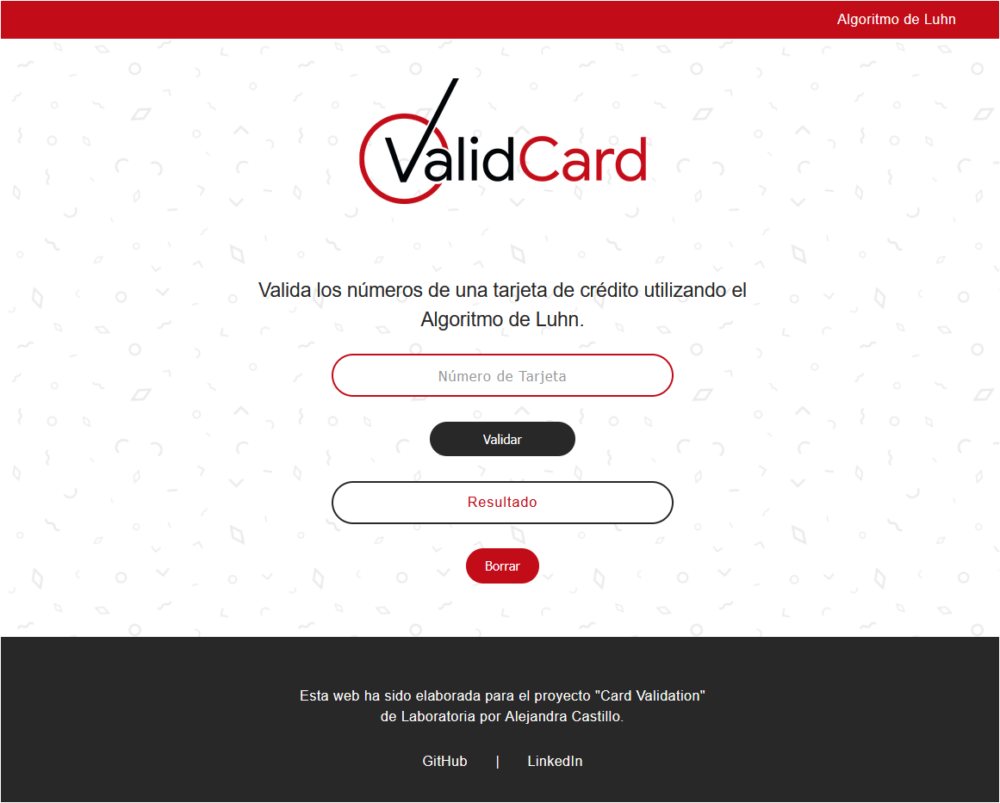
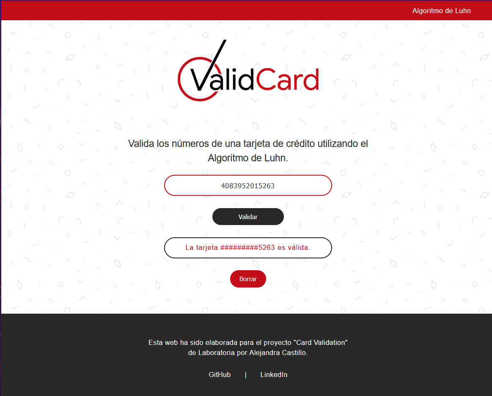

# CARD VALIDATION

# Validación de Tarjeta

[Link de la página desplegada](https://alextina.github.io/DEV003-card-validation/)

## Introducción:

En este proyecto se ha construido una aplicación web que permite al usuario validar el número de una tarjeta de crédito, así como ocultar todos los dígitos de una tarjeta menos los últimos cuatro. Para la principal función, la de validación de la tarjeta, se aplicó el algoritmo de Luhn, también conocido como algoritmo de módulo 10.

### Usuarios

Personas que ingresen a la página web de **Christine Bisutería**, y deseen validar su tarjeta antes de realizar una compra.

### Uso de la aplicación:

Ambas funcionalidades se han implementado para que los usuarios puedan validar su tarjeta de una forma segura, antes de realizar la compra. 

Hay un campo en el que usuario puede ingresar solo números (de 13 a 16 dígitos) y al hacer clic en el botón **validar** le retornará gracias a la función `isValid` si la tarjeta es o no válida, y además el **número estará oculto** debido a la función `maskify`.

Además, si el usuario requiere escribir un nuevo número de tarjeta, puede hacerlo luego de utilizar el botón **borrar**.

#### Ejemplo:

**El usuario ingresa: 4083952015263**

**Y la aplicación retornará:  La tarjeta #########5263 es válida.**

## Pila de tecnología:

### Interfaz

`HTML` `CSS` `JavaScript`

## Descripción de scripts/archivos

* `index.html`: Este es el punto de entrada a la aplicación, la estructura y textos de la página.

* `index.js`: Aquí se escucha los eventos del DOM y se invocan a `validator.isValid()` y `validator.maskify()` según sea necesario y actualizar el resultado en la UI (interfaz de usuario). 

* `validator.js`: Aquí se implementa el objeto `validator` y contiene los métodos `isValid`y `maskify`.

* `style.css`: Este archivo contiene las reglas de estilo de la página.
